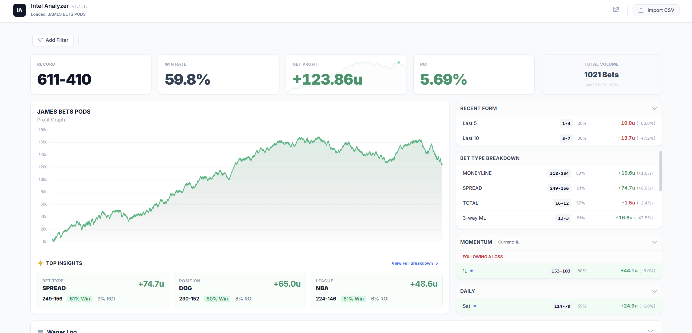

# Intel Analyzer

A client-side sports betting analytics dashboard that turns CSV exports into interactive performance insights. Import your betting history and instantly see your record, win rate, ROI, profit trends, and more — all processed locally in the browser with zero backend.

## Features

- **CSV Import** — Drag-and-drop or file-pick any sportsbook CSV export. Auto-detects columns (picks, odds, units, profit, league, etc.)
- **KPI Dashboard** — Record, win rate, net profit, ROI, and total volume at a glance
- **Profit Graph** — Cumulative P/L chart with tooltips showing each bet
- **Advanced Filtering** — Filter by any column: league, bet type, position, date range, numeric ranges. Quick-combine filter shortcuts for common slices
- **Bet Type Breakdown** — Performance split by moneyline, spread, totals, 3-way ML
- **Recent Form** — Last 5 / Last 10 / Last 25 / Last 50 win rate and P/L
- **Momentum Analysis** — Win/loss streak performance (e.g., "how do you do after 2 consecutive losses?")
- **Day-of-Week Stats** — Performance by day with today highlighted
- **Wager Log** — Searchable, sortable table of all bets with full-screen mode
- **Export Stats** — Copy formatted stats to clipboard
- **Keyboard Navigation** — Full keyboard support for power users
- **Fully Client-Side** — No server, no database. Your data never leaves your browser

## Quick Start

1. Clone the repo
2. Open `sports_betting_stats_calculator.html` in your browser
3. Click **Import CSV** and select your betting history file

That's it. No install, no build step, no dependencies to manage.

## CSV Format

The app auto-detects column headers. At minimum, your CSV should have columns for:

| Column | Examples |
|--------|----------|
| Pick/Play/Team | `Chiefs -3`, `Over 224.5` |
| Odds | `-110`, `+150` |
| Units/Wagered | `1`, `2.5` |
| Profit/Return | `0.91`, `-1.00` |
| Result *(optional)* | `Win`, `Loss`, `W`, `L` |
| League *(optional)* | `NBA`, `NFL`, `MLB` |
| Date *(optional)* | `2024-01-15`, `1/15/2024` |

The app is flexible — it scans the first ~20 rows to infer column types and will derive results from profit values if no explicit result column exists.

## Tech Stack

- **[Tailwind CSS](https://tailwindcss.com/)** — Utility-first styling (CDN)
- **[Chart.js](https://www.chartjs.org/)** — Profit graphs and sparklines
- **[PapaParse](https://www.papaparse.com/)** — CSV parsing
- **[Inter](https://rsms.me/inter/) + [JetBrains Mono](https://www.jetbrains.com/lp/mono/)** — Typography

All dependencies are loaded via CDN. No build tools required.

## License

MIT
